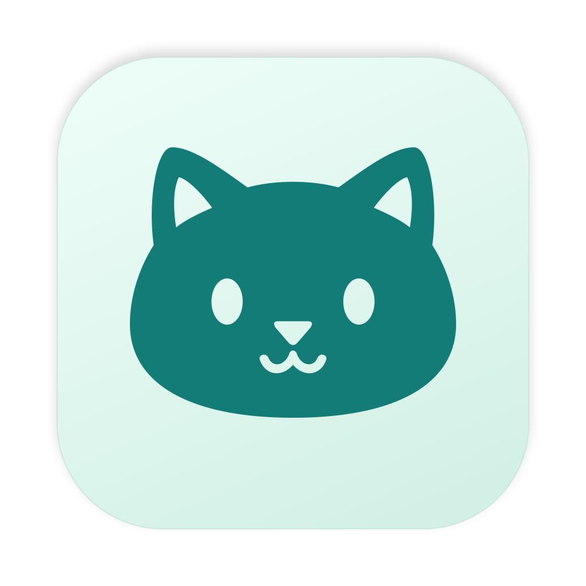

# TokenCat



[](https://pypi.org/project/tokencat/)
[](LICENSE)

TokenCat shows how many tokens your AI coding tools use and estimates their API-equivalent cost from locally recorded usage. Use the macOS menu bar app for background monitoring, or the terminal CLI for reports, JSON exports, and totals across machines.

- See usage by coding tool, model, project, and task.
- Inspect recent activity, cached tokens, and linked subagent usage.
- Keep usage collection local, with anonymous session IDs and hidden project paths by default.

## Choose an interface

| Coding tool | macOS app | Stable CLI | CLI candidate |
| --- | :---: | :---: | :---: |
| Codex | Yes | Yes | Yes |
| Claude Code | Yes | Yes | Yes |
| OpenCode | Yes | Yes | Yes |
| Antigravity | Yes | Yes | Yes |
| Gemini CLI | — | Yes | — |
| GitHub Copilot Chat/Agent and CLI | — | Yes | — |

Choose the macOS app for background monitoring, the stable CLI for terminal reports and multi-machine aggregation, or the experimental CLI candidate for local dashboards. The two CLI commands can be installed together.

The app requires macOS 14 or newer. The CLI supports macOS and Linux with Python 3.9 or newer. Windows is not supported. Multi-machine aggregation is available in the stable CLI.

## macOS app

### Install from source

You need Rust and Xcode's Swift toolchain with the macOS 26 SDK or newer. The app runs independently of Python and pipx.

From a checkout of this repository:

```bash
bash macos/scripts/build-app.sh
open build/TokenCat.app
```

The app is created at `build/TokenCat.app`. Move it to `/Applications` before enabling **Launch at Login** in Settings. To update, rebuild, quit the running copy, and open the new app.

### Use the app

Click the cat in the menu bar to see today's estimated cost and open the usage panel. Choose **Today**, **7 days**, or **30 days**, then open the dashboard for more detail.

In the dashboard you can:

- Search models, projects, and tasks; sort by cost, tokens, or recent activity.
- Switch the activity chart between recorded tokens and known API cost.
- Open a task to inspect its own usage and related subagents.

Open Settings with the settings button or **Command–comma**. Choose language, appearance, time zone, refresh interval, and source folders. English and Simplified Chinese are included. Usage refreshes every two seconds by default and resumes when the Mac wakes.

Standard source locations are detected automatically:

| Tool | Default locations |
| --- | --- |
| Codex | `~/.codex/sessions` and `~/.codex/archived_sessions` |
| Claude Code | `~/.claude/projects` and `~/.config/claude/projects` |
| OpenCode | `~/.local/share/opencode/opencode.db`, honoring `XDG_DATA_HOME` |
| Antigravity | `conversations` under `~/.gemini/antigravity` and `~/.gemini/antigravity-cli` |

If your tools store data elsewhere, set their roots in Settings. Project paths stay hidden unless you enable them.

## CLI candidate (experimental)

The candidate shows local usage for Codex, Claude Code, OpenCode, and Antigravity. It runs as `tokencat-candidate` and supports dashboards and JSON export. Remote aggregation and the stable CLI's other commands are unavailable.

From a checkout, with Rust and a C compiler installed:

```bash
pipx install ./candidate
tokencat-candidate
tokencat-candidate dashboard --since 30d --weekly
tokencat-candidate --provider claude --timezone America/New_York
tokencat-candidate --since 7d --json
```

The default view shows the last seven days; `dashboard` also shows recent sessions. Use `--daily`, `--weekly`, or `--monthly` to choose the calendar grouping, and `--theme light` or `--theme dark` for terminal colors. Time windows use the system time zone unless you pass `--timezone`. Date-only `--until` values include that whole day; datetime end bounds are exclusive.

Standard source locations are detected automatically. For other locations, use `--codex-root`, `--claude-root`, `--opencode-root`, or `--antigravity-root`; pass the tool's root folder containing the source subdirectories listed above. Claude and Antigravity options can be repeated for multiple folders. Run `tokencat-candidate --help` for all options.

The candidate includes offline prices. Use `--pricing-path` to select a custom LiteLLM catalog, or `--no-price` to hide terminal cost columns. Missing prices appear as unknown and uncertain estimates appear as a range. `--no-price` cannot be combined with `--json`.

JSON exports use a different format from the stable CLI. Session identifiers are anonymized and project paths are hidden; diagnostic warnings may include source file paths.

To remove the candidate, run `pipx uninstall tokencat-native`. Your stable CLI and saved candidate usage remain available.

## Stable terminal CLI

### Install or upgrade

```bash
pipx install tokencat
```

To update an existing installation:

```bash
pipx upgrade tokencat
```

To install from a repository checkout, use `pipx install .`.

### Common commands

```bash
tokencat                                 # Default 7-day dashboard
tokencat --since 30d                      # A longer window
tokencat sessions --provider claude --limit 20
tokencat summary --json                   # Structured output
tokencat doctor                          # Check detected sources and warnings
```

| Command | Shows |
| --- | --- |
| `tokencat` or `tokencat dashboard` | Usage overview, activity, models, and recent sessions |
| `tokencat summary` | Totals by coding tool |
| `tokencat sessions` | Individual sessions |
| `tokencat models` | Totals by model |
| `tokencat daily` | Daily usage |
| `tokencat doctor` | Source detection, health, and pricing warnings |
| `tokencat pricing show` | Catalog freshness and pricing coverage |
| `tokencat pricing refresh` | Refresh the local pricing catalog |

Use `--provider` to filter tools, `--since` and `--until` for dates, and `--json` to export supported reports. The dashboard also accepts `--daily`, `--weekly`, `--monthly`, and `--theme auto|dark|light`. Use `--no-price` to show usage without cost estimates.

Session titles and paths are hidden by default. Include them explicitly with `tokencat sessions --show-title --show-path`. Run `tokencat --help` or `tokencat <command> --help` for all options.


### Combine multiple machines

For SSH aggregation, install TokenCat on each remote machine and add its host to `~/.ssh/config`. Select and trust the hosts locally:

```bash
tokencat nodes --trust
tokencat dashboard --lan
```

TokenCat obtains usage snapshots over SSH; a remote HTTP server is not required. Use `tokencat nodes --remove` to remove trusted hosts.

For HTTP nodes, set `TOKENCAT_NODE_TOKEN` to your shared secret and start `tokencat serve --lan` on the remote machine. Manage the background server with `tokencat serve --status`, `--logs`, or `--stop`. Trust a specific address with `tokencat nodes --url http://HOST:8765 --trust`.

Automatic HTTP-node discovery requires the optional extra: `pipx install "tokencat[mdns]"`. SSH discovery works with the base installation. If mDNS is unavailable on your network, use SSH or an explicit HTTP address.

## Prices and privacy

Costs are **API-equivalent estimates, not your bill or subscription balance**. TokenCat counts recorded tokens even when a model has no price record. Unknown prices stay visible; usage without a confirmed date may be excluded from time-window totals. Estimates do not include every billing tier, tool fee, or regional adjustment.

All interfaces include offline prices and show pricing coverage and sources. The macOS app checks for updates every 24 hours by default; Settings offers manual refresh, other intervals, an off switch, and a custom catalog. Update the stable CLI's prices with `tokencat pricing refresh`. The candidate uses bundled or custom prices without automatic updates. Failed updates preserve available prices. Estimates can differ between interfaces because their catalogs and usage accounting differ.

Usage collection reads local records. TokenCat does not proxy requests, change provider endpoints, or read OAuth/session credentials for reporting. Reports exclude prompt and response bodies. Price updates access the network; remote aggregation exchanges usage snapshots with machines you explicitly trust.

## Troubleshooting

**A tool is missing or shows no usage.** Make sure it has recorded local activity under the same user account. Check source roots in app Settings, or run `tokencat doctor` in the CLI. For nonstandard CLI locations, `CLAUDE_CONFIG_DIR` accepts comma-separated Claude roots and `XDG_DATA_HOME` sets the OpenCode data location.

**Copilot CLI activity has not appeared yet.** Its CLI adapter counts shutdown summaries. Active sessions without a shutdown summary are reported as partial by `tokencat doctor`.

**Costs look different from an invoice.** TokenCat estimates standard API usage, including when a tool is used through a subscription. Check pricing coverage and unknown models before comparing totals. Updating the catalog can change estimates for earlier dates.

**Where is TokenCat's data stored?** The app keeps usage and downloaded prices in `~/Library/Application Support/TokenCat/`. The stable CLI stores prices, node identity, trust settings, and server logs under `~/.tokencat/`. The candidate saves usage in `~/.tokencat-candidate/`; use `--data-dir` to choose another folder. Removing source logs does not erase usage already saved by the app or candidate.

## Contributing

See [development and testing](docs/development.md) for local checks, source builds, and performance measurement. [Architecture and decisions](docs/architecture.md) records collection, privacy, and pricing design choices. Report problems in [GitHub Issues](https://github.com/xiaoran007/TokenCat/issues).

## License

TokenCat is licensed under [GNU GPLv3](LICENSE).
